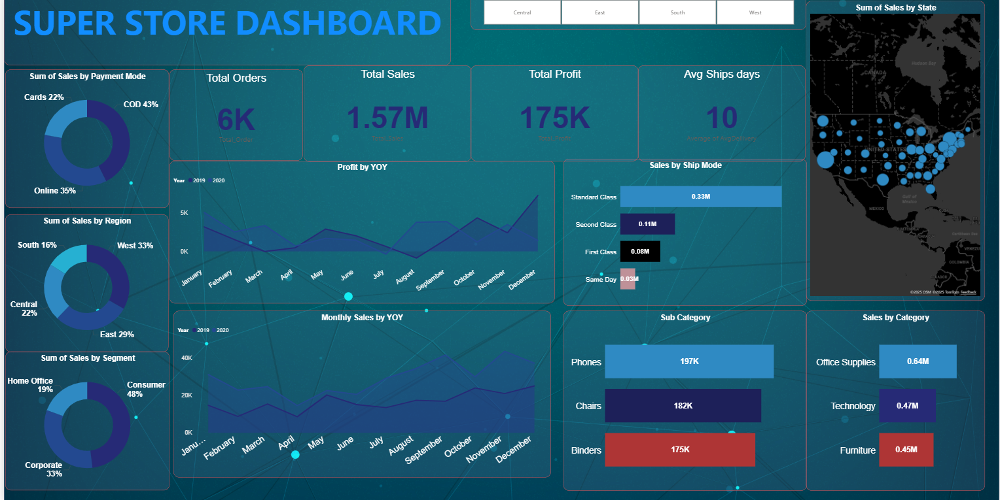

# superstore-powerbi-dashboard
Power BI dashboard analyzing sales, profit, shipping, and regional performance using the SuperStore dataset.
# 📊 SuperStore Sales Dashboard — Power BI Project

An interactive and insight-driven **Power BI dashboard** built using the SuperStore dataset.  
This project demonstrates skills in data cleaning, modeling, DAX, visualization, and business insight generation.

---

## 📸 Dashboard Preview

---

## 🚀 Project Overview

This dashboard provides a deep analysis of:

- Sales trends  
- Profit distribution  
- Customer segments  
- Regional performance  
- Shipping modes  
- Year-over-year behavior  

Designed with clean visuals and a business-oriented layout.

---

## 🧩 Key Features

### ✔ KPI Cards
- Total Orders: 6K  
- Total Sales: 1.57M  
- Total Profit: 175K  
- Avg Shipping Days: 10  

### ✔ Visuals Included
- Sales by Payment Mode  
- Sales by Segment  
- Sales by Region  
- Sales by Category & Sub-Category  
- Profit YOY Trend  
- Monthly Sales YOY  
- Sales by Shipping Mode  
- US Geo Map  

---

## 📁 Project Structure

